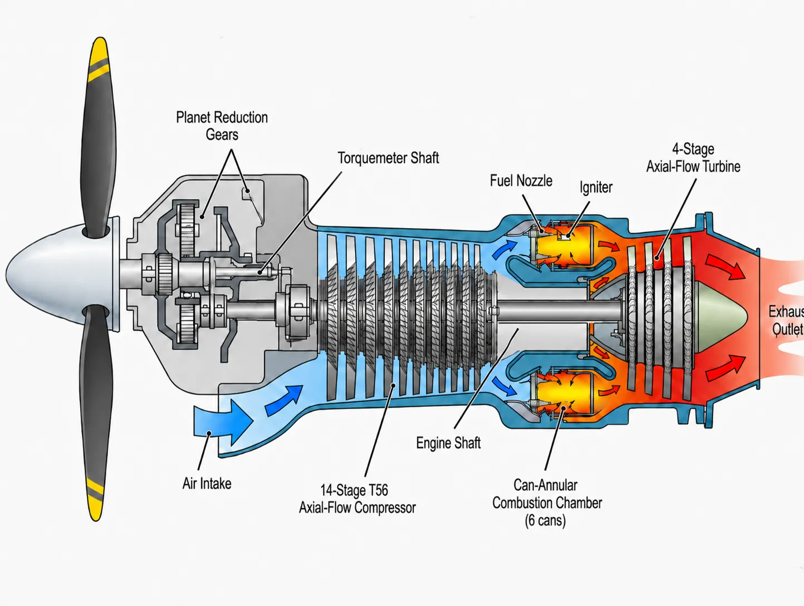
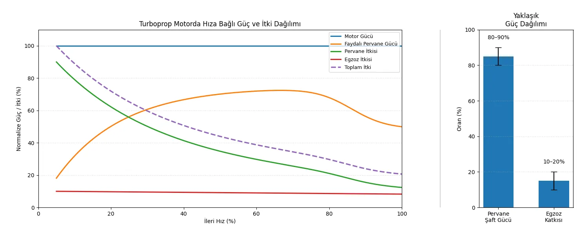
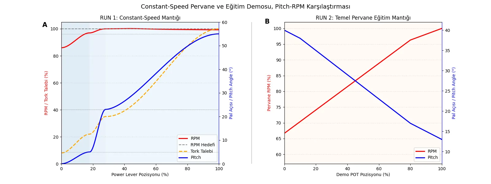

# Turboprop Motorlarda Pervane Kontrol Mantığı: C-130 Esintili 3D Eğitim Modeli

> Turboprop motorlar dışarıdan bakıldığında basit görünebilir: motor döner, pervane havayı iter ve uçak ilerler. Fakat özellikle büyük turboprop uçaklarda olay sadece “pervaneyi döndürmek” değildir. Motorun ürettiği gücün pervaneye nasıl aktarıldığı, pervane devrinin nasıl kontrol edildiği, pal açısının neye göre değiştiği ve governor sisteminin bu değişkenleri nasıl dengelediği birlikte düşünülmelidir.
>
> Bu proje de tam olarak bu mantığı görselleştirmek için ortaya çıktı. Hazırladığım model, gerçek bir uçak sisteminin birebir çalışan kopyası değil; turboprop motor-pervane ilişkisinin daha anlaşılır hâle gelmesi için tasarlanmış bir eğitim demonstratörüdür. Dış görünümde R391 tarzı modern altı palli pervane geometrisinden esinlenilirken, kontrol mantığında C-130 ailesinde görülen T56 - constant-speed, condition lever prensipleri temel alınmıştır.

<!-- GÖRSEL TUTUCU: Hero / Poster
     Açıklama: C-130 esintili turboprop eğitim modeli için hazırlanan ana poster veya kapak görseli
     SearchKeywords: C-130 turboprop training model T56 R391 propeller control infographic -->

## Turboprop Motorda Güç Pervaneye Nasıl Aktarılır?

Turboprop motor, gaz türbinli motor ile pervane sisteminin birlikte çalıştığı bir yapıdır. Motorun içinde hava sıkıştırılır, yakıtla karıştırılarak yakılır ve oluşan yüksek enerjili gaz türbin üzerinden güç üretir. Türbinden elde edilen gücün yaklaşık %80-90'ı pervaneyi döndürmek için redüksiyon dişli kutusu üzerinden aktarılır; geriye kalan %10-20'lik kısım ise egzoz çıkışında itkiye dönüşür.

Buradaki redüksiyon dişli kutusu kritik bir parçadır. Türbin tarafı çok yüksek devirlerde çalışırken (11.000-14.000 RPM), pervane daha düşük devirde fakat yüksek torkla dönmelidir. Rolls-Royce, T56 motorunu single-shaft, modular design bir turboprop olarak tanımlar; motor 14 kademeli aksiyel kompresör, 4 kademeli türbin ve iki kademeli redüksiyon dişli kutusu içerir.

C-130 gibi büyük turboprop uçaklarda bu güç aktarımı sadece mekanik bir bağlantı değildir. Pervanenin havayı ne kadar “ısırdığı” yani pal açısı da sistemin ne kadar güç emeceğini belirler. Bu nedenle pervane, motor gücünü havaya aktaran pasif bir döner parça değil, aktif olarak kontrol edilen bir sistemdir.

<!-- DİYAGRAM TUTUCU: Turboprop Güç Aktarım Şeması
     Açıklama: Air inlet, kompresör, yanma odası, türbin, redüksiyon dişli kutusu ve pervane arasındaki güç aktarımını gösteren basit şema
     SearchKeywords: turboprop engine power flow reduction gearbox propeller diagram -->

<!-- GRAFİK TUTUCU: Güç Dağılımı
     Açıklama: Turboprop motorda türbinden elde edilen gücün büyük kısmının pervane şaftına, küçük kısmının ise jet itişine gittiğini gösteren pasta veya çubuk grafik
     Eksenler: Kategori = Pervane şaft gücü / Kalan jet itişi | Değer = Yaklaşık oran (%)
     SearchKeywords: turboprop power distribution propeller shaft residual thrust chart -->

## Değişken Hatveli Pervane Nedir?

Sabit hatveli bir pervanede pal açısı değişmez ve optimum hücum açısı genellikle 2 ile 4 derece arasındadır. Bu, basit ve dayanıklı bir çözümdür; ancak Pal açısı sabit olduğu için pervane yalnızca belirli bir hız ve devir kombinasyonunda en verimli noktasında çalışabilir. Kalkış, tırmanış, seyir, iniş ve motor arızası gibi durumlarda pervaneden beklenen davranış değişir.

Değişken hatveli pervanede ise paller kendi ekseni etrafında döndürülerek farklı hücum açılarına getirilebilir. Düşük pal açısında pervane havayı daha az yükler ve daha kolay döner. Yüksek pal açısında ise pervane her turda daha fazla hava ile etkileşime girer ve daha fazla aerodinamik yük oluşturur.

Bu mantık otomobillerdeki vites oranına benzetilebilir. Düşük pal açısı, düşük vitese benzer: motor daha kolay devirlenir. Yüksek pal açısı ise daha yüksek vitese benzer: sistem daha fazla yük taşır ama uygun hızda daha verimli çalışır.

Modelde kullanılan temsilî pal açısı değerleri, C-130/T56 sistemiyle ilgili teknik referanslardan yararlanılarak aşağıdaki tabloda yaklaşık olarak belirlenmiştir.
<!-- TABLO: Modelde Kullanılan Temsilî Pal Açısı Değerleri -->

| Çalışma Bölgesi | Temsilî Pal Açısı | Açıklama |
|---|---:|---|
| Low Pitch / Ground | ~0° – 5° | Pervane minimum aerodinamik yükte |
| Flight Idle / Low Pitch Stop | ~23° | Governor tarafından izin verilen minimum uçuş açısı |
| Takeoff / Climb | ~23° – 35° | Yüksek güç, artan pal açısı |
| Cruise / High Pitch | ~35° – 55° | Seyir verimi için yüksek pal açısı |
| Full Feather | ~93° | Pal hava akışına paralel; minimum sürükleme |

FAA kaynaklı bu şema, değişken hatveli turboprop pervanelerde pal açısının feather, power, flight idle, ground idle ve reverse bölgeleri arasında nasıl değiştiğini gösterir.

")
<!-- DİYAGRAM TUTUCU: Pal Açısı ve Feather Görünümü
     Açıklama: Düşük pitch, yüksek pitch ve full feather konumlarını yandan ve/veya kesit görünümle anlatan teknik diyagram
     SearchKeywords: variable pitch propeller low pitch high pitch feather diagram -->

## Constant-Speed Mantığı

Bu yazıdaki en önemli kavramlardan biri constant-speed propeller mantığıdır. Constant-speed sistemde amaç, pervane RPM değerini belirli bir hedef değere yakın tutmaktır. Pilot veya sistem daha fazla güç istediğinde motor daha fazla tork üretir. Pervane hızlanmaya çalışır; governor ise pal açısını değiştirerek pervanenin daha fazla yük almasını sağlar. Böylece güç artarken pervane RPM değeri sabite yakın tutulur.

FAA eğitim materyallerinde turboprop motor pervanelerinde "düşük pitch / yüksek RPM" ayarının kalkış için, "daha yüksek pitch / daha düşük RPM" ayarının ise uçuş sonrası verimlilik için kullanılabileceği anlatılır. Ancak C-130/T56 gibi sistemlerde bu ilişki doğrudan Power Lever üzerinden “kol ileri = RPM artar” şeklinde okunmamalıdır. C-130 uçuş dokümanlarında flight range içinde pervane hızının governor sistemiyle constant RPM tutulduğu; ground range içinde ise pal açısının throttle / power lever konumuna daha doğrudan bağlı olduğu açıklanır.

Bu nedenle modelde iki farklı RUN mantığı kullanmak daha doğru oldu. Birinci mod, C-130 constant-speed davranışına daha yakındır: Power Lever ileri alındıkça motor devri büyük ölçüde sabite yakın kalır, asıl değişim pal açısında gösterilir. İkinci mod ise genel turboprop eğitim mantığını anlatır: "yüksek RPM + düşük pitch" ve "düşük RPM + yüksek pitch" ilişkisi daha sezgisel şekilde gösterilir.

<!-- DİYAGRAM TUTUCU: Governor Çalışma Prensibi
     Açıklama: Constant-speed propeller governor'ın pilot valve, flyweight ve blade angle feedback döngüsünü gösteren şematik diyagram
     SearchKeywords: constant speed propeller governor pilot valve flyweight schematic -->

<!-- GRAFİK TUTUCU: RPM vs Power Lever Pozisyonu
     Açıklama: Constant-speed sistemde Power Lever ileri alındıkça RPM'in sabite yakın kaldığını, pal açısı ve torkun arttığını gösteren çizgi grafik
     Eksenler: X = Power Lever pozisyonu (%) | Y₁ = Pervane RPM | Y₂ = Pal açısı (°) | Y₃ = Tork (ft-lbs)
     SearchKeywords: constant speed propeller RPM torque blade angle vs power lever graph -->

## Neden C-130 ve T56 Örneği?

C-130 ailesi, turboprop motor-pervane ilişkisini anlamak için güçlü bir örnektir. Klasik C-130E/H gibi modellerde Allison şimdiki adıyla Rolls-Royce T56 motoru ve 54H60 pervane sistemi kullanılır. Daha modern C-130J tarafında ise Rolls-Royce AE2100D3 motoru ve Dowty/GE Aerospace R391 altı palli kompozit pervane sistemi bulunur.

Bu projede C-130J’nin birebir kokpit sistemi kopyalanmamıştır. R391 görünümü daha modern ve görsel olarak güçlü olduğu için modelin dış görünümünde tercih edilmiştir. Kontrol mantığı ise özellikle T56/54H60 sistemindeki condition lever, feather, ground stop, air start ve constant-speed kavramlarını anlatmaya yöneliktir.

C-130 ailesindeki farklı motor ve pervane sistemlerine bakıldığında ilginç bir ortak nokta görülür: pervane devri yaklaşık 1020 RPM civarında kontrol edilir. Klasik T56 sisteminde motorun yüksek devri redüksiyon dişli kutusu ile pervane tarafında yaklaşık 1021 RPM seviyesine düşürülür. C-130J tarafında kullanılan R391 pervanesinde de takeoff propeller speed değeri yaklaşık 1020,7 RPM olarak verilir. Bu değerler, turboprop sistemlerde Power Lever ileri alındığında pervane devrinin sürekli artmadığını anlatmak için önemlidir. Constant-speed mantığında sistem, pervane RPM’ini sabite yakın tutmaya çalışır; değişen şey daha çok tork, yakıt akışı ve pal açısıdır.

<!-- TABLO TUTUCU: C-130 Ailesinde Motor ve Pervane Karşılaştırması
     Açıklama: C-130E/H ve C-130J tarafındaki motor, pervane, pal sayısı, kontrol karakteri ve yaklaşık pervane RPM değerlerini karşılaştıran tablo
     Sütunlar: Sistem | Motor | Pervane | Pal Sayısı | Kontrol Karakteri | Yaklaşık Pervane RPM
     SearchKeywords: C-130E H T56 54H60 C-130J AE2100 R391 propeller comparison -->

<!-- GÖRSEL TUTUCU: T56 / 54H60 ve R391 Referans Görseli
     Açıklama: Klasik T56/54H60 sistemini ve R391 tarzı altı palli modern pervane görünümünü karşılaştıran sade görsel
     SearchKeywords: C-130 T56 54H60 propeller R391 six blade propeller comparison -->

## 3D Eğitim Demonstratör Modeli

Bu modelin amacı gerçek bir C-130 pervane sistemini birebir kopyalamak değil. Gerçek uçakta hidrolik governor, propeller control unit, fuel control, torquemeter, redüksiyon dişli kutusu, NTS sistemi ve uçuş şartlarına bağlı aerodinamik yükler birlikte çalışır.

Modelde ise gerçek sistemdeki bu karmaşık yapı; servo motor, DC motor, potansiyometreli kollar, toggle switch, amber LED ve yazılım eğrileriyle temsil edilmektedir. Temel 3D geometri için Cadly’nin Turboprop modelinden yararlanılmıştır; bu noktada model geometrisi için Cadly’ye teşekkürlerimi sunarım. Bunun dışında elektronik bağlantılar, kontrol mantığı, lever modları, AIR START animasyonu ve yazılım tarafı bu proje kapsamında özel olarak geliştirilmiştir.

Modelde iki ana kontrol bulunur:

**Power Lever:** Güç talebini temsil eder. RUN modunda seçilen çalışma yaklaşımına göre motor PWM değeri ve pal açısı eğrilerini etkiler.

**Condition Lever:** Motorun çalışma durumunu temsil eder. FEATHER, GROUND STOP, RUN ve AIR START konumları üzerinden modelin davranışı değiştirilir.

Bunlara ek olarak toggle switch, RUN modu içinde iki farklı mantık seçmek için kullanılır. Böylece model hem C-130 constant-speed davranışını hem de genel turboprop pitch/RPM eğitim mantığını gösterebilir.

<!-- GÖRSEL TUTUCU: Fotoğraf
     Açıklama: 3D baskı turboprop demonstratör modelinin genel görünümü
     SearchKeywords: 3D printed turboprop propeller pitch demonstrator model -->

<!-- GÖRSEL TUTUCU: Kontrol Paneli Fotoğrafı
     Açıklama: Power Lever, Condition Lever, toggle switch, amber LED ve elektronik bağlantıların yakın plan görünümü
     SearchKeywords: model aircraft power lever condition lever toggle switch LED Arduino servo DC motor -->

<!-- DİYAGRAM TUTUCU: Elektronik Kontrol Blok Diyagramı
     Açıklama: Power Lever, Condition Lever, toggle switch, kontrol kartı, servo motor, DC motor sürücüsü ve amber LED arasındaki bağlantıları gösteren blok diyagram
     SearchKeywords: Arduino servo DC motor potentiometer lever toggle switch LED block diagram -->

## Modeldeki Çalışma Modları

Modelde Condition Lever için dört temel davranış kullanılmıştır.

<!-- TABLO: Condition Lever Pozisyonları ve İşlevleri -->

| Pozisyon | Tip | İşlev |
|---|---|---|
| **RUN** | Detent (kilitli) | Engine fuel ve ignition sistemlerini speed-sensitive control altına alır. Bu konumda Condition Lever'ın pervane üzerinde doğrudan kontrolü yoktur. |
| **AIR START** | Yay kuvvetine karşı tutulur | RUN ile aynı switch'i kapatır; ek olarak propeller auxiliary pump'ı çalıştırarak pervaneyi unfeather etmek için hidrolik basınç sağlar. |
| **GROUND STOP** | Detent (kilitli) | Touchdown sistemi yer modundaysa elektrikli yakıt kapatma valfini kapatır. Nacelle preheat devre kontrolünü de sağlar. |
| **FEATHER** | Mekanik bağlantı + switch | Engine-mounted coordinator üzerinden pervaneye ve fuel control shutoff valve'a mekanik hareket iletir; pervaneye mekanik ve elektriksel feather sinyali verir. |

*Kaynak: C-130 Flight Manual, CGTO 1C-130-1 ([Uniforce-SOG][5])*

Modelde Condition Lever için kullanılan demonstratör modları:

| Gerçek Pozisyon | Model Modu | Demonstratör Davranışı |
|---|---|---|
| FEATHER | PROP FEATHER | Motor PWM = 0, pal açısı → 93°, Power Lever yok sayılır |
| GROUND STOP | PROP DEMO | Motor çalışmaz, Power Lever ile yalnızca pal açısı değişir |
| RUN | NORMAL OPERATION | Toggle switch'e göre iki farklı PWM–pal açısı eğrisi |
| AIR START | UNFEATHER DEMO | LED animasyonu + lineer pal açısı geçişi (93° → 23°) |

<!-- DİYAGRAM TUTUCU: Condition Lever Konumları
     Açıklama: Tek bir Condition Lever kolu üzerinde FEATHER, GROUND STOP, RUN ve AIR START konumlarını gösteren yay/slot diyagramı
     SearchKeywords: C-130 condition lever FEATHER GROUND STOP RUN AIR START diagram -->

<!-- VİDEO TUTUCU: C-130 Motor Kapatma ve Feather
     Açıklama: Gerçek C-130 kokpitinde Condition Lever'ın FEATHER konumuna çekilmesi ve pervane bayraklamasının görüntüsü
     Örnek URL: https://www.youtube.com/watch?v=5wKr6YmzTgM
     SearchKeywords: C-130 condition lever feather engine shutdown cockpit video -->

**FEATHER / PROP FEATHER:**  
Motor PWM değeri sıfıra çekilir, pal açısı yaklaşık 93° feather konumuna gider ve Power Lever yok sayılır. Bu konum, motor arızası veya motor durdurma sonrası sürüklemeyi azaltma mantığını gösterir.

**GROUND STOP / PROP DEMO:**  
Gerçek C-130 sisteminde GROUND STOP, Condition Lever üzerindeki motor durdurma konumudur. Modelde bu konuma eğitim amaçlı bir ek davranış verilmiştir: motor dönmez, ancak Power Lever ile yalnızca pal açısı gösterilebilir. Bu, mekanik test ve güvenli sunum için kullanışlıdır.

**RUN / NORMAL OPERATION:**  
Modelin normal çalışma modudur. Toggle switch konumuna göre iki farklı RUN mantığı seçilir. C-130 constant-speed modunda motor devri sabite yakın tutulur ve pal açısı artar. Genel turboprop demo modunda ise RPM ve pitch ilişkisi daha eğitim odaklı gösterilir.

**AIR START / UNFEATHER DEMO:**  
Bu mod feather’dan çıkış ve yeniden çalıştırma sürecini görsel olarak temsil eder. Gerçek C-130/T56 sisteminde AIR START konumu, RUN ile aynı anahtarı kapatır ve ek olarak propeller auxiliary pump devresini çalıştırarak unfeather için hidrolik basınç sağlar. Modelde bu süreç; amber LED göstergesi, yavaş pal açısı geçişi ve motor PWM artışı ile temsil edilir.

<!-- DİYAGRAM TUTUCU: AIR START / UNFEATHER Akışı
     Açıklama: 93° feather konumundan 23° düşük pitch konumuna doğru lineer unfeather geçişini, amber LED durumunu ve manuel RUN geçişini gösteren akış diyagramı
     SearchKeywords: turboprop air start unfeather sequence feather to low pitch LED -->

<!-- GRAFİK TUTUCU: AIR START Sekansında Pal Açısı ve PWM
     Açıklama: AIR START sırasında pal açısının 93°'ten 23°'e inerken motor PWM değerinin kademeli arttığını gösteren zaman grafiği
     Eksenler: X = Zaman (s) | Y₁ = Pal açısı (°) | Y₂ = Motor PWM
     SearchKeywords: air start unfeather blade angle motor PWM time graph -->

## Kısaca: NTS Nedir?

NTS, yani **Negative Torque Sensing**, T56 motorlu C-130 sisteminde negatif tork durumunu algılayan bir koruma mantığıdır. Normalde motor pervaneyi döndürür; ancak bazı arıza veya güç kaybı durumlarında bu ilişki tersine dönebilir ve pervane, hava akışı nedeniyle motoru sürmeye başlayabilir. Buna negatif tork denir.

Negatif tork oluştuğunda pervane ciddi sürükleme yaratabilir ve uçağın dengesini olumsuz etkileyebilir. NTS sistemi bu durumu azaltmak için pervane pal açısını artırmaya yönelik bir sinyal üretir. Böylece pervane daha kaba hatveye yönelerek motoru sürme eğilimini azaltır.

Bu modelde NTS fiziksel olarak uygulanmamıştır. Yani sistemde gerçek bir tork algılama veya otomatik koruma mekanizması bulunmaz. Ancak NTS kavramından kısaca bahsetmek önemlidir; çünkü turboprop pervane kontrolünün yalnızca “motor döner, pervane döner” mantığından ibaret olmadığını gösterir. Gerçek sistemde pervane, motor gücü, hava akışı, pal açısı ve güvenlik mekanizmaları birlikte çalışır.

<!-- DİYAGRAM TUTUCU: NTS Kavram Şeması
     Açıklama: Negatif tork durumunda pervanenin motoru sürmeye çalışmasını ve NTS sinyalinin pal açısını artırarak sürüklemeyi azaltmasını gösteren basit diyagram
     SearchKeywords: Negative Torque Sensing T56 C-130 NTS propeller drag blade angle diagram -->

## Teknik Sınırlamalar

Bu model kavramsal bir demonstratördür. Bu yüzden bazı sınırlamalar bilinçli olarak kabul edilmiştir.

Birincisi, servo açısı gerçek pervane pal açısı mekanizmasının birebir karşılığı değildir. İkincisi, DC motor PWM değeri yalnızca görsel bir dönüş hızı temsili olarak kullanılmaktadır; bu değer gerçek pervane RPM değerinin doğrudan karşılığı olarak görülmemelidir. Üçüncüsü, modelde gerçek hidrolik governor, gerçek tork geri bildirimi, gerçek hava yükü ve NTS mekanizması bulunmaz.

Ayrıca mevcut mekanik tasarım negatif pal açısı bölgesini desteklemediği için reverse thrust fiziksel olarak uygulanmamıştır. Yazılımda reverse mantığı bilinse de mevcut model, low pitch, flight idle, cruise/high pitch, feather ve air-start/unfeather davranışlarına odaklanır.

Bu sınırlamalar modelin zayıflığı değil, amacının bir sonucudur. Hedef operasyonel doğruluk değil, turboprop pervane kontrol mantığını anlaşılır ve görsel hâle getirmektir.

<!-- TABLO TUTUCU: Model Sınırlamaları
     Açıklama: Modelde temsil edilen ve fiziksel olarak uygulanmayan sistemleri karşılaştıran tablo
     Sütunlar: Özellik | Modelde Temsil Ediliyor mu? | Gerçek Sistemdeki Karşılığı | Not
     SearchKeywords: 3D demonstrator model limitations turboprop propeller governor NTS reverse thrust -->

## Sonuç

Turboprop motorlarda pervane yalnızca dönen bir parça değildir; motor gücünü havaya aktaran, pal açısı ve devir kontrolüyle yönetilen aktif bir sistemdir. C-130 ailesi, bu mantığı anlamak için güçlü bir örnek sunar. T56 motoru, 54H60 pervane sistemi, R391’in modern pervane geometrisi, constant-speed mantığı, Condition Lever konumları ve feather / air start süreçleri bu eğitim modeli için iyi bir teknik temel oluşturur.

Hazırlanan 3D demonstratör, bu karmaşık yapıyı daha anlaşılır hâle getirmek için tasarlanmıştır. Servo kontrollü pal açısı, DC motorla temsil edilen pervane dönüşü, Power Lever, Condition Lever, toggle switch ile seçilen iki RUN modu ve AIR START animasyonu sayesinde model, turboprop motor-pervane ilişkisini görsel olarak anlatabilir.

Bu çalışma, bir uçuş simülatörü veya gerçek C-130 sistemi kopyası değildir. Daha doğru tanımıyla: turboprop motorlarda güç aktarımı, constant-speed pervane mantığı ve pervane kontrol modlarını açıklayan 3D baskı bir eğitim modelidir.

<!-- GÖRSEL TUTUCU: Final Poster / Özet Görsel
     Açıklama: Uçak, T56/R391 konsepti, demonstratör model, Condition Lever, Power Lever ve proje URL'sini bir arada gösteren A3 poster
     SearchKeywords: C-130 motor modeli turboprop demonstrator poster T56 R391 condition lever power lever -->

## Kaynaklar

[1]: https://www.rolls-royce.com/products-and-services/defence/aerospace/transport-tanker-patrol-and-tactical/t56.aspx "Rolls-Royce — T56 turboprop engine"
[2]: https://www.rolls-royce.com/products-and-services/defence/aerospace/transport-tanker-patrol-and-tactical/ae-2100.aspx "Rolls-Royce — AE2100 turboprop engine"
[3]: https://airandspace.si.edu/collection-objects/propeller-variable-pitch-6-blade-dowty-r391/nasm_A20070022000 "Smithsonian National Air and Space Museum — Dowty R391 propeller"
[4]: https://www.caa.co.uk/Documents/Download/3940/77d2f18a-4292-443a-8980-607aade5d45a/1112 "UK CAA / EASA — R391 Type Certificate Data Sheet"
[5]: https://uniforce-sog.org/wp-content/uploads/2024/07/USCG-Lockheed-C-130-Flight-Manual.pdf "C-130 Flight Manual, CGTO 1C-130-1"
[6]: https://www.lockheedmartin.com/content/dam/lockheed-martin/aero/documents/sustainment/csc/service-news/sn-mag-v11-v20/V16N1.pdf "Lockheed Martin Service News — T56 reduction ratio and propeller RPM"
[7]: https://www.faa.gov/sites/faa.gov/files/09_amtp_ch7.pdf "FAA Aviation Maintenance Technician Handbook — Chapter 7, Propellers"
